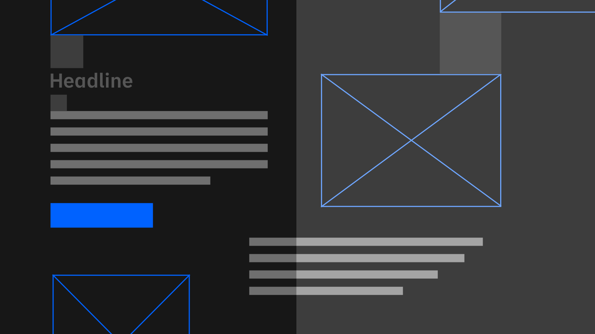

import HomepageTemplate from "gatsby-theme-carbon/src/templates/Homepage";
import {
  ArticleContainer,
  BrandsList,
  SnapContent,
  SnapCard,
  SignUpContainer,
  BannerContainer,
  RequestDemoContent,
} from "gatsby-theme-carbon/src/templates/HomepageComponents";
import { Button } from "carbon-components-react";

export default HomepageTemplate;

<BannerContainer 
  title="Seamless & Cost Effective EDI Onboarding"
  content="Increasingly complex multi-enterprise systems need a scalable, flexible, performant fault tolerant network. "
  buttonLabel="Start free trial"
>

</BannerContainer>

<BrandsList
  title="Eliminate increasingly complex multi-enterprise systems, today"
  content="To stand apart in today’s hyper-connected, global economy, you need to radically simplify connectivity between people, systems and data that matter to your business. Our xEDI Enterprise ready system manages an increasingly complex, multi-enterprise ecosystem from disparate systems, processes, policies and tools. "
>
  <Row>
    <Column colMd={2} colLg={2}>
      <Button kind="secondary" href="#">
        Blu Jay Solutions
      </Button>
    </Column>
    <Column colMd={2} colLg={2}>
      <Button kind="secondary" href="#">
        PC Miler 
      </Button>
    </Column>
    <Column colMd={2} colLg={2}>
      <Button kind="secondary" href="#">
        Samsara
      </Button>
    </Column>
    <Column colMd={2} colLg={2}>
      <Button kind="secondary" href="#">
        SAFER/IFTA
      </Button>
    </Column>
    <Column colMd={2} colLg={2}>
      <Button kind="secondary" href="#">
        Customs
      </Button>
    </Column>
    <Column colMd={2} colLg={2}>
      <Button kind="secondary" href="#">
        Loadboards
      </Button>
    </Column>
  </Row>
</BrandsList>

<SnapContent title="Built using performant, scalable infrastructure ">
  <Row>
    <Column colSm={12} colMd={6} colLg={6}>
      <SnapCard
        title="Drewry"
        buttonLabel="Container Freight Index"
        content="Connect once to transact other bussiness, globally. Freight Trust not only enables the shortest integration time for any EDI, it also provides insights, financial integrations, and analytics.""
      />
    </Column>
    <Column colSm={12} colMd={6} colLg={6}>
      <SnapCard
        title="Matchback Systems"
        buttonLabel="Street Turn Optimization"
        content="Nemo enim ipsam voluptatem quia voluptas sit aspernatur aut odit aut fugit, sed quia consequuntur magni dolores eos qui ratione voluptatem sequi nesciunt. Neque porro quisquam est."
      />
    </Column>
    <Column colSm={12} colMd={6} colLg={6}>
      <SnapCard
        title="KX.com"
        buttonLabel="kdb+"
        content="Visualize and query streaming and historical data in real time with ultimate performance using one platform. See an ROI on your investment within days."
      />
    </Column>
    <Column colSm={12} colMd={6} colLg={6}>
      <SnapCard
        title="Smart Contracts"
        buttonLabel="Besu"
        content="Nemo enim ipsam voluptatem quia voluptas sit aspernatur aut odit aut fugit, sed quia consequuntur magni dolores eos qui ratione voluptatem sequi nesciunt. Neque porro quisquam est."
      />
    </Column>
  </Row>
</SnapContent>

<ArticleContainer
  title="The Enterprise Ecosystem"
  subTitle="By leveraging the high-performance historical time-series columnar database called kdb+, an in-memory compute engine, and a real-time streaming processor, NP-hard problems become yesterdays problem."
>
<Row>
<Column colMd={4} colLg={4}>
    <ArticleCard
      subTitle="combinatoral"
      title="Matchback Systems"
      color="dark"
      >

  </ArticleCard>
</Column>
<Column colMd={4} colLg={4}>
    <ArticleCard
      subTitle="maidenlane"
      title="Smart Contract Engine"
      color="dark"
      >

  </ArticleCard>
</Column>
<Column colMd={4} colLg={4}>
    <ArticleCard
      subTitle="hyperledger"
      title="Besu Enterprise"
      color="dark"
      >

  </ArticleCard>
</Column>
</Row>
</ArticleContainer>

<SignUpContainer
  title="A Clear & Immediate ROI has never been easier."
  subTitle=" Maidenlane is specifically designed for high-volume, complex transformation and validation of data across a range of different formats and standards."
></SignUpContainer>

<RequestDemoContent
  title="Get Started Today"
  subTitle="Request a Demo"
>
  <Button href="#" kind="secondary">
    Request Demo
  </Button>
  <Button href="#" kind="tertiary">
    Contact Us
  </Button>
</RequestDemoContent>
